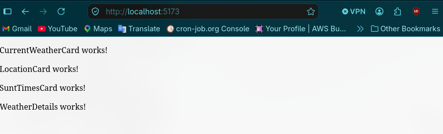

# Weather Dashboard

Inicio el proyecto con el commit: 936444c40f744ddb130810ff0ec4c74147ff26cc creando la estructura del proyecto

Voy a consumir la API <https://openweathermap.org/>
Para eso analizando la respuesta del endpoint de temperatura actual:

Endpoint y example:
<https://api.openweathermap.org/data/2.5/weather?lat=44.34&lon=10.99&appid={API_key}>

``` json
{
  "coord": {
    "lon": 10.99,
    "lat": 44.34
  },
  "weather": [
    {
      "id": 501,
      "main": "Rain",
      "description": "moderate rain",
      "icon": "10d"
    }
  ],
  "base": "stations",
  "main": {
    "temp": 298.48,
    "feels_like": 298.74,
    "temp_min": 297.56,
    "temp_max": 300.05,
    "pressure": 1015,
    "humidity": 64,
    "sea_level": 1015,
    "grnd_level": 933
  },
  "visibility": 10000,
  "wind": {
    "speed": 0.62,
    "deg": 349,
    "gust": 1.18
  },
  "rain": {
    "1h": 3.16
  },
  "clouds": {
    "all": 100
  },
  "dt": 1661870592,
  "sys": {
    "type": 2,
    "id": 2075663,
    "country": "IT",
    "sunrise": 1661834187,
    "sunset": 1661882248
  },
  "timezone": 7200,
  "id": 3163858,
  "name": "Zocca",
  "cod": 200
}
```

Podría crear varios componentes viendo esta respuesta de la API, pero primero comenzaré con 5:

´´´ bash
src/
├── components/
│   ├── WeatherDashboard.tsx
│   ├── LocationCard.tsx
│   ├── CurrentWeatherCard.tsx
│   ├── WeatherDetails.tsx
│   └── SunTimesCard.tsx
´´´

Crearé cinco funciones que retornen TSX, por ahora solo etiquetas que retornen texto.
Tambien voy a importarlas y declararlas en el TSX de App



Todos estos cambios pertenecen al commit: 