# Web Development — Laboratory 4: SPA Multi-Página con Estado Compartido

**Estudiante:** Catriel Pereira Torrez
**Institución:** Jala University
**Materia:** Web Development
**Documento:** Laboratorio Semana 4
**Fecha:** 24 de septiembre, 2026

## 1. Enrutamiento (React Router)

Para poder realizar routeo primero cree un componente nuevo llamado Navbar


Que se ve así:


Y en la App.tsx en lugar de solo colocar nuestra pagina padre, colocaré Route, no sin antes wrappear todo `<App />` con la tag `<BrowserRouter />` en `main.tsx`


Ahora las etiquetas `<NavLink />` pueden redirigir a las routes como React esta pensado.

Uso `<NavLink />` y no `<Link />` porque, aparte de ser una etiqueta mas semantica, tiene un valor valor booleano integrado que te dice si estas o no seleccionandola, lo que sirve mucho para darle estilos dinamicos haciendo uso de la concatenacion de strings en las className de las tags.

Para lograr que mi pagina sea dinamica y mantenga el navbar y en un futuro un footer, voy a crear un layout, que será como un marco de página o contenedor para cada página que cambie con las routes.

Para eso voy a crear una estructura anidada de Routes en App, de esta manera:


Y también creé el `AppLayout` que es:

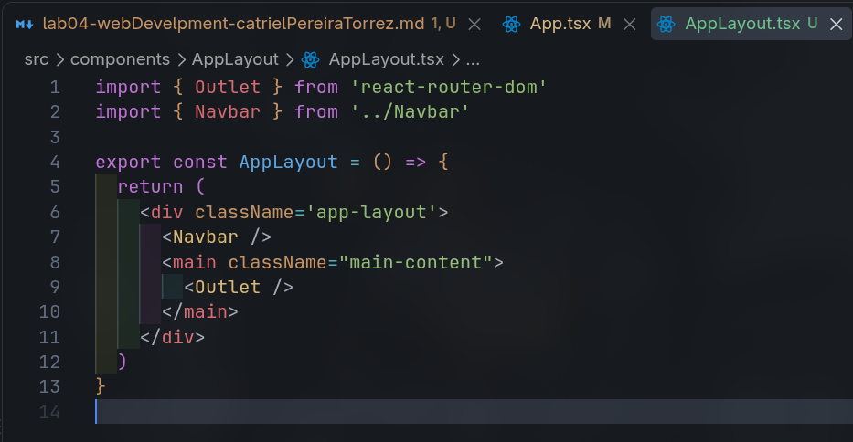

Estoy preveyendo la existencia de Forescast por city, feature que aún no hice.

Por ahora redirige a una mi componente estático `EmptyState`

## Refactorización: Migración a Data Router

Para seguir las mejores prácticas y desacoplar responsabilidades, saqué la configuración de rutas de `App.tsx` a un módulo dedicado en `src/router/index.tsx` usando `createBrowserRouter`.

¿Por qué este cambio?

- **Separación de responsabilidades:** `App.tsx` queda limpio y no se llena de imports de páginas.
- **Escalabilidad:** La navegación se define como un arreglo de objetos centralizado fuera del ciclo de render de React.
- **Data Loaders:** Permite precargar datos de la API en rutas dinámicas como `/forecast/:city`.

En `src/router/index.tsx`:

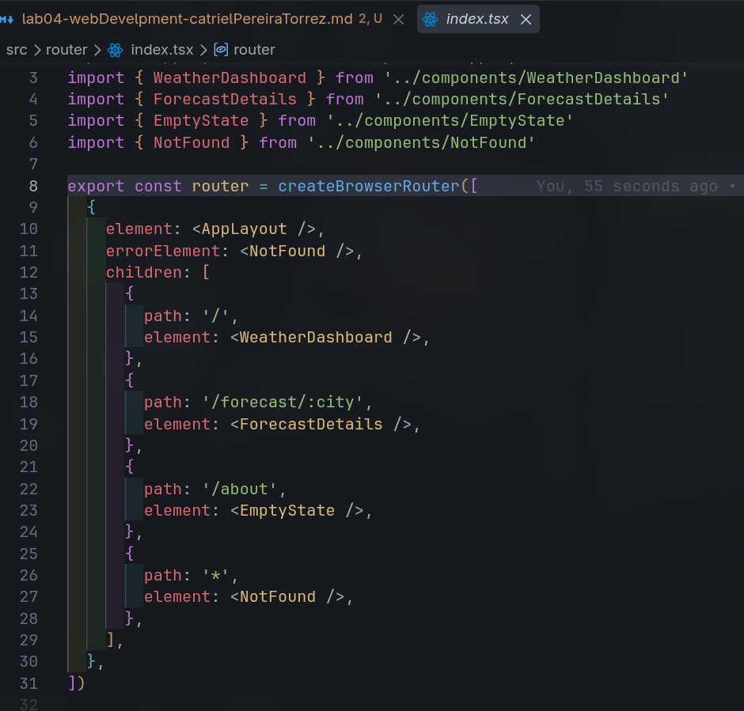

Con esto, `App.tsx` solo consume el router mediante `<RouterProvider />`:


Algo importante: Al usar `RouterProvider`, se quitó `<BrowserRouter />` de `main.tsx` porque el nuevo router ya gestiona el contexto internamente.

## Forecast page, junto con el dynamic route

Para crear esta sección primero definí en el router una ruta dinámica que recibe el nombre de la ciudad como parámetro:

`/forecast/:city`

### Endpoint y Estructura de la API

Para obtener las predicciones a futuro, consulto el endpoint gratuito de 5 días de OpenWeather pasando las coordenadas:

```bash
curl "https://api.openweathermap.org/data/2.5/forecast?lat=-17.3935&lon=-66.1565&units=metric&appid=$API_KEY"
```

La respuesta nos entrega `cod: "200"`, `cnt: 40`, el objeto `city` y un arreglo `list` con 40 predicciones (una cada 3 horas a lo largo de 5 días). La estructura resumida se ve así:

```json
{
  "cod": "200",
  "message": 0,
  "cnt": 40,
  "list": [
    {
      "dt": 1790618400,
      "main": {
        "temp": 25.27,
        "feels_like": 24.66,
        "temp_min": 25.27,
        "temp_max": 25.27,
        "pressure": 1009,
        "sea_level": 1009,
        "grnd_level": 698,
        "humidity": 31,
        "temp_kf": 0,
        "dew_point": 3.41
      },
      "weather": [
        {
          "id": 801,
          "main": "Clouds",
          "description": "few clouds",
          "icon": "02d"
        }
      ],
      "clouds": { "all": 15 },
      "wind": { "speed": 8.42, "deg": 31, "gust": 8.01 },
      "visibility": 10000,
      "pop": 0,
      "sys": { "pod": "d" },
      "dt_txt": "2026-09-28 18:00:00"
    }
  ],
  "city": {
    "id": 3919968,
    "name": "Cochabamba",
    "coord": { "lat": -17.3935, "lon": -66.1565 },
    "country": "BO",
    "population": 900414,
    "timezone": -14400,
    "sunrise": 1790158404,
    "sunset": 1790202039
  }
}
```

De cada ítem nos interesa:

- `dt_txt`: Fecha y hora de la medición (ej. `2026-09-28 18:00:00`).
- `main.temp` y `feels_like`: Temperatura real y sensación térmica.
- `weather`: Condición (`main`) y el código del icono oficial (`icon: "02d"`).
- `pop`: Probabilidad de precipitación (`0` a `1`).
- `wind.speed`: Velocidad del viento.

### 1. Tipado y Servicio

Antes de consumir la API, tipé en `src/types/weather.ts` la respuesta del endpoint con `ForecastItem` y `ForecastResponse`.

En `src/services/weatherService.ts` creé la función `getForecast(lat, lon)` que consulta el endpoint gratuito de OpenWeather (`/data/2.5/forecast`). Como este endpoint devuelve 40 mediciones (cada 3 horas), filtré la lista quedándome únicamente con los reportes de las `18:00:00`, obteniendo exactamente 1 predicción por día para los próximos 5 días.

### 2. Helper de fecha y Card Component

Para mostrar los días de forma amigable ("Tomorrow", "Fri", "Sat", etc.) en lugar de fechas en números, creé un helper en `src/utils/date.ts`:

- Uso `.replace(' ', 'T')` para convertir la fecha a formato ISO estándar compatible con todos los navegadores.
- Uso `toLocaleDateString('en-US', { weekday: 'short' })` para obtener las 3 letras del día. Si es el primer elemento, muestro `"Tomorrow"`.

Luego creé `ForecastCard` como componente vertical para cada día, mostrando el nombre del día, la condición, el icono oficial de OpenWeather (`@2x.png`), temperatura y métricas de viento y probabilidad de lluvia.

### 3. Navegación programática con coordenadas

En `LocationCard` añadí un botón para navegar hacia el pronóstico. Como ya teníamos las coordenadas (`lat` y `lon`) de la ciudad buscada en el dashboard, usé el hook `useNavigate` para viajar hacia la ruta pasando las coordenadas:

- En la URL mediante query params: `?lat=${lat}&lon=${lon}`
- En memoria mediante `state: { lat, lon, name, country }`

### 4. Componente `ForecastDetails`

En la página de destino combino varios hooks:

- `useParams<{ city: string }>()`: para leer el nombre de la ciudad de la URL.
- `useLocation()`: para leer las coordenadas desde el `state` en memoria.
- `useSearchParams()`: como respaldo por si el usuario recarga la página (F5) y el `state` se pierde, recuperando las coordenadas directamente de la URL.
- `useEffect()`: para disparar la petición a `getForecast(lat, lon)` y guardar los datos en un estado `forecastList`.

Finalmente, recorro los reportes con un `.map()` dentro de una cuadrícula de 5 columnas renderizando las tarjetas `ForecastCard`.

## 2. Gestión de Estado (`useContext`)

### Para solucionar Prop Drilling y Estado Global

Antes de este cambio, el toggle de modo oscuro vivía únicamente dentro de `WeatherDashboard`, manejando el estado mediante props locales (`isDark` y `onToggle`).

Al introducir navegación con múltiples páginas (`/`, `/about`, `/forecast/:city`), surge la necesidad de que el toggle estuviera disponible globalmente en (`Navbar`) y que cualquier componente o página futura pudiera consultar o alternar el tema sin tener que pasar estados y funciones de componente en componente, evitando el prop drilling.

Para solucionar esto, implementé la API de Contexto de React (`createContext` y `useContext`).

### Estructura modular en `src/context/`

Separé la lógica en archivos específicos dentro de `src/context/`:

```bash
src/context/
├── ThemeContext.ts    # Definición del contexto, tipos y custom hook useTheme
├── ThemeProvider.tsx  # Componente proveedor del estado
└── index.ts           # Barrel file para exportar
```

#### 1. Definición del Contexto y Custom Hook

En `src/context/ThemeContext.ts` definí el contrato de datos y creé un custom hook para consumir el contexto de forma segura:

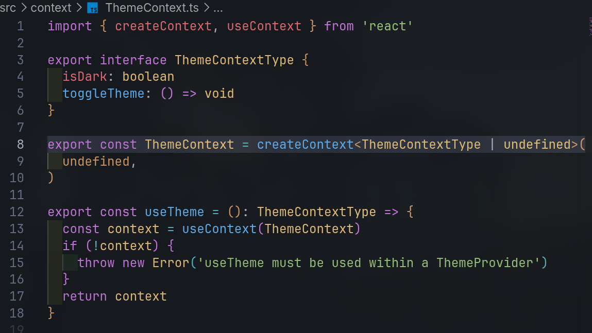

- **`ThemeContextType`**: Interfaz de TypeScript que define los valores que viajan por el contexto.
- **`useTheme()`**: En lugar de obligar a cada componente a importar `ThemeContext` y usar `useContext(ThemeContext)` manualmente, creé este hook personalizado que además, incluye una validación: si un componente intenta usarlo fuera del `<ThemeProvider>`, arroja un error descriptivo en vez de fallar silenciosamente con `undefined`.

#### 2. Componente Provider

En `src/context/ThemeProvider.tsx` creé el componente que administra el estado real y la persistencia:

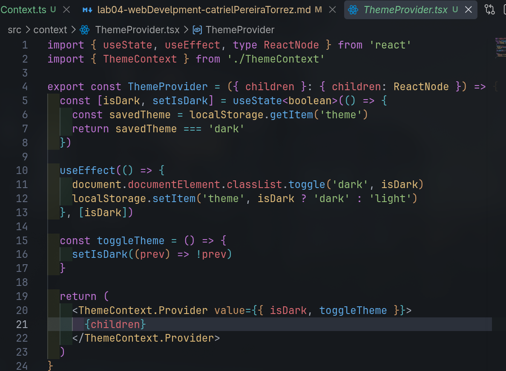

- **`ReactNode`**: Utilicé este tipo de React para tipar `children`. `ReactNode` representa cualquier contenido que React puede renderizar (elementos JSX, texto, números o fragmentos), permitiendo que `<ThemeProvider>` funcione como un contenedor envolvente genérico.

- Al iniciar, el estado lee si el usuario ya tenía guardada su preferencia previa (`localStorage.getItem('theme')`).

- Con `useEffect`, cada vez que `isDark` cambia, se agrega o quita la clase `.dark` en la raíz del documento (`document.documentElement`), activando las variables de colores en CSS y guardando el nuevo valor en `localStorage`.

#### 3. Exportación

En `src/context/index.ts` centralicé las exportaciones.

Esto me permite importar tanto el proveedor como el hook desde cualquier parte de la aplicación haciendo `import { useTheme } from '../context'`.

---

### Refactor en la Aplicación

#### 1. Envolviendo la raíz en `App.tsx`

Envolví todo el enrutador dentro de `<ThemeProvider>`:

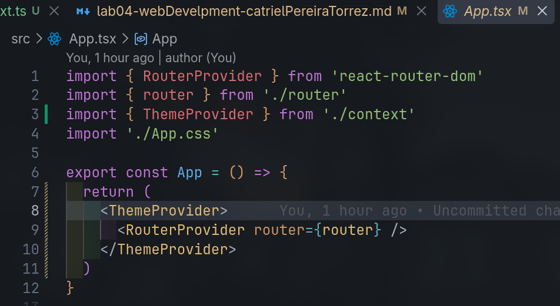

Al colocarlo en la cima del árbol, todas las rutas hijas y layouts heredan el contexto automáticamente.

#### 2. Refactorización de `ThemeToggle`

Modifiqué el componente `ThemeToggle` para que ya no reciba props:

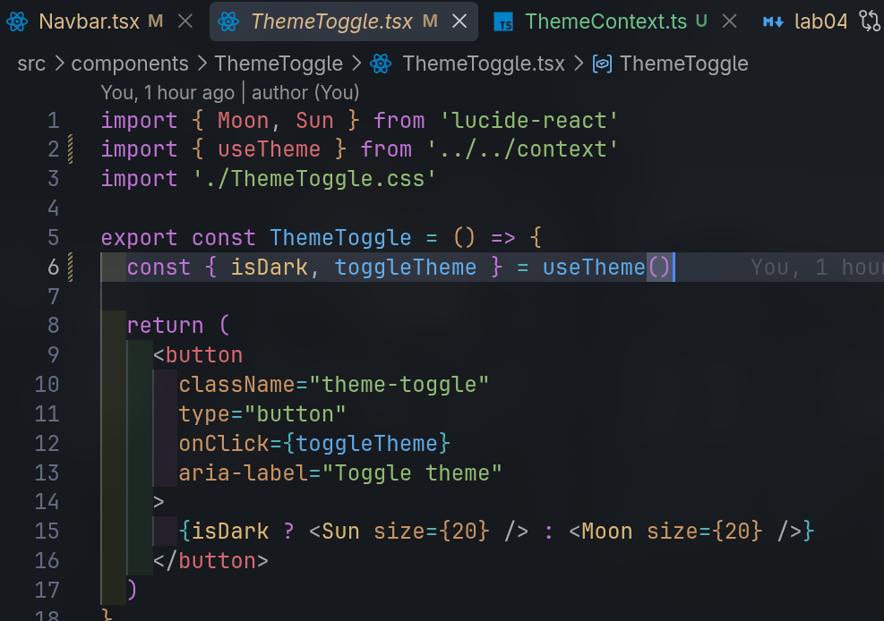

Quedo muy limpio, me gusta.

#### 3. Ubicación global en el `Navbar`

Monté `<ThemeToggle />` directamente dentro de `Navbar.tsx` al lado de los enlaces de navegación, logrando que el botón esté accesible en todo momento sin importar en qué vista se encuentre el usuario y eliminé la instancia que estaba dentro de `WeatherDashboard.tsx`.

## 3. Hook Personalizado

En la versión inicial de `WeatherDashboard.tsx`, la consulta del clima actual se realizaba mediante un `useState` y un `useEffect` que llamaba directamente a la función del servicio.

No existía un indicador visual de carga por lo que la pantalla no daba retroalimentación mientras la API respondía, no existía una captura de errores visual en pantalla (`error`).

Existía el riesgo de race Conditions si el usuario buscaba y seleccionaba varias ciudades rápidamente, una respuesta lenta de una búsqueda previa podía llegar después y sobreescribir los datos más recientes.

Para resolver esto y hacer la lógica reutilizable en cualquier parte de la aplicación, creé el hook personalizado `useFetch`.

---

### Creación del Custom Hook

Centralicé la lógica de fetching en `src/hooks/useFetch.ts`:

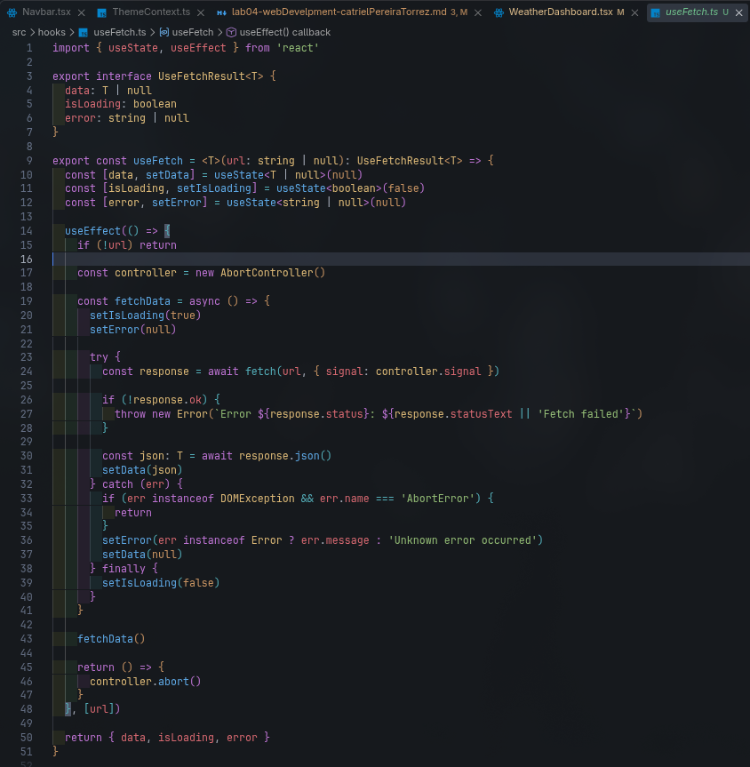

#### Aspectos clave del diseño

1. El hook es genérico. Quien lo consume especifica qué estructura espera (por ejemplo, `<WeatherData>`), manteniendo el tipado estricto.

2. Utilicé la API nativa de JavaScript `AbortController`. Al pasar `controller.signal` a `fetch()`, el navegador queda vinculado a la señal de cancelación.

3. En la función de limpieza (`return () => controller.abort()`), si el usuario cambia de página o selecciona otra ciudad antes de que termine la petición actual, la conexión HTTP se cancela inmediatamente a nivel de red, evitando _memory leaks_ y sobreescrituras desfasadas.

En el bloque `catch`, filtro las excepciones de tipo `AbortError` para que las cancelaciones voluntarias no se interpreten como errores para el usuario.

---

### Integración en el Servicio y Dashboard

#### 1. Constructor de URL

Para no ensuciar los componentes con URLs ni llaves de API, exporté en `src/services/weatherService.ts` una función constructora:

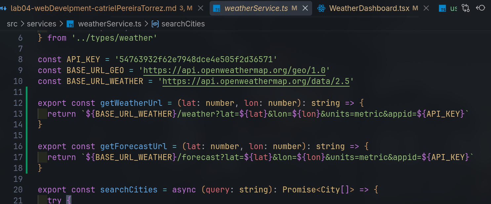

#### 2. Consumo en `WeatherDashboard.tsx`

Refactoricé `WeatherDashboard.tsx` para consumir directamente el hook:

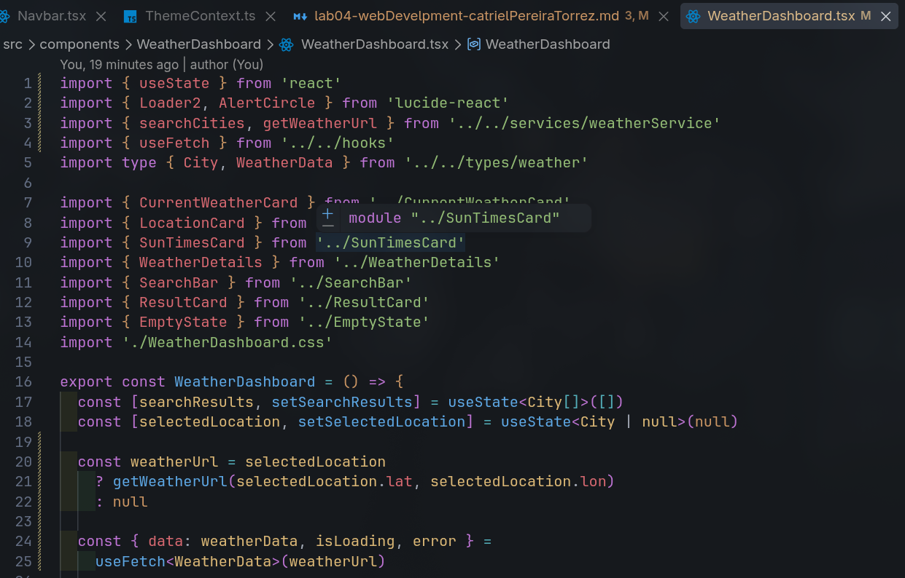

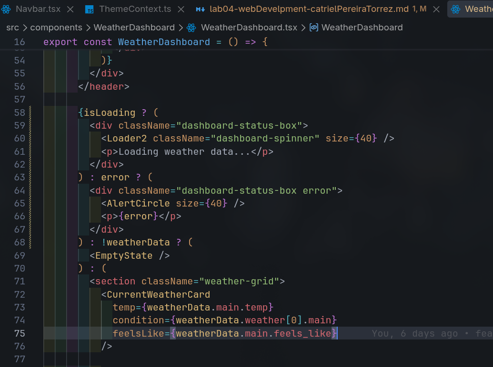

#### 3. Estados visuales de Carga y Error

En el JSX del dashboard añadí retroalimentación visual según el estado que devuelve `useFetch`:

- **Cargando (`isLoading`)**: Muestra un contenedor estilizado con el icono animado `Loader2` de Lucide.
- **Error (`error`)**: Muestra un cuadro de advertencia con `AlertCircle` indicando el mensaje del error.
- **Sin datos (`!weatherData`)**: Muestra el componente `EmptyState`.
- **Éxito**: Despliega la cuadrícula con las tarjetas del clima (`CurrentWeatherCard`, `LocationCard`, `SunTimesCard`, `WeatherDetails`).

## 4. Rendimiento con Lazy Loading

### Problema del Bundle

Por defecto, cuando importamos todos los componentes con `import` estáticos al inicio de nuestro router, Vite empaqueta todo el código de la aplicación en un solo archivo JavaScript gigante.

Esto significa que cuando un usuario entra por primera vez a la página principal solo para consultar el clima de hoy, su navegador se ve forzado a descargar también el código de páginas que tal vez nunca visite.

A medida que una aplicación crece esto degrada el tiempo de carga inicial

Para solucionar esto, implementé Code Splitting mediante Lazy Loading.

---

### ¿Por qué la propiedad `lazy` de React Router en lugar de `React.lazy` con `<Suspense>`?

Al haber migrado previamente nuestro enrutador a la arquitectura moderna de Data Router con `createBrowserRouter`, tenemos a nuestra disposición la propiedad nativa **`lazy`** en las definiciones de ruta.

Decidí aprovechar esta característica en lugar del tradicional `React.lazy` + `<Suspense>` manual por las siguientes ventajas técnicas:

1. **Cero Boilerplate:** No necesitamos importar `<Suspense>` ni crear manualmente contenedores de envoltura en cada vista; el router se encarga de la suspensión y el ciclo de vida de la transición de forma automática.
2. **Soporte para Named Exports:** No fue necesario alterar `About.tsx` para forzar un `export default`. Podemos importar directamente la exportación nombrada `{ About }`.
3. **Eliminación de Waterfalls:** Si en el futuro la ruta requiere precargar datos mediante un `loader`, React Router puede descargar el componente y los datos en paralelo en un solo viaje de red, evitando esperar a que el componente cargue para recién pedir los datos.
4. **Mismo beneficio de empaquetado:** A nivel de compilador, Vite reconoce el `import()` dinámico de la misma forma que con `React.lazy` y genera un chunk independiente.

---

### Implementación en `src/router/index.tsx`

Eliminé la importación estática de `About` y configuré la ruta de forma diferida mediante una función asíncrona que retorna `{ Component: About }`:

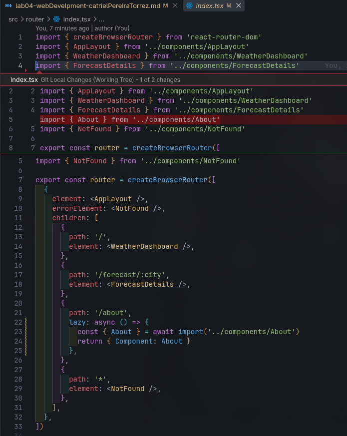

---

### Verificación y Generación de Chunks en Vite

Al ejecutar el comando de construcción en producción:

```bash
npm run build
```

Vite genera los artefactos demostrando que la ruta `/about` fue aislada exitosamente en sus propios archivos de JS y CSS:

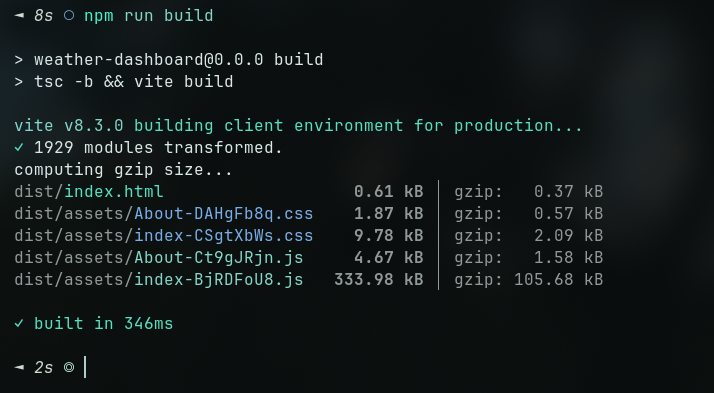

- **`index-*.js`**: Redujo su tamaño ya que no contiene el código de `About`.
- **`About-*.js` (4.67 kB)** y **`About-*.css` (1.87 kB)**: Ahora son un chunk independiente que el navegador descarga bajo demanda únicamente cuando el usuario navega a la URL `/about`.

## 5. Conclusiones

Puedes usar la web final desplegada en AWS aquí:  
<https://dnr3v5hngcmwc.cloudfront.net>

Como no tenemos repositorios para la materia, estoy subiendo todo esto a mi github personal:  
<https://github.com/Catriel42/weather-dashboard>
