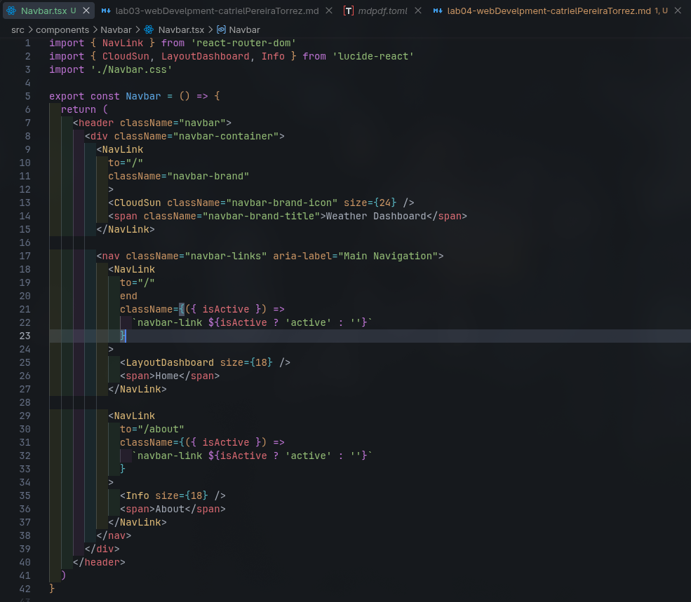
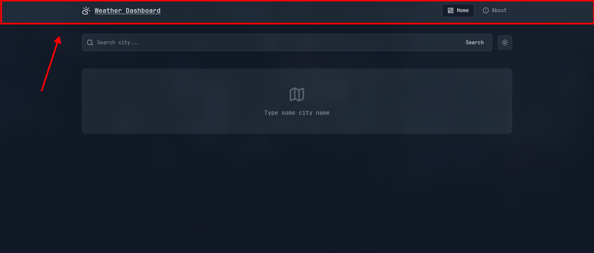
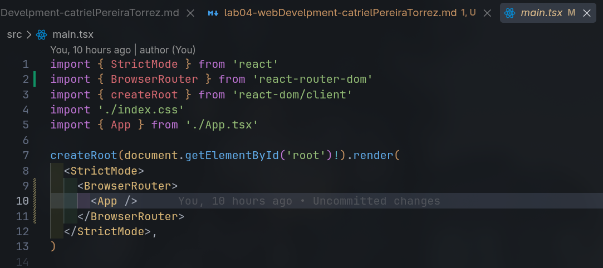
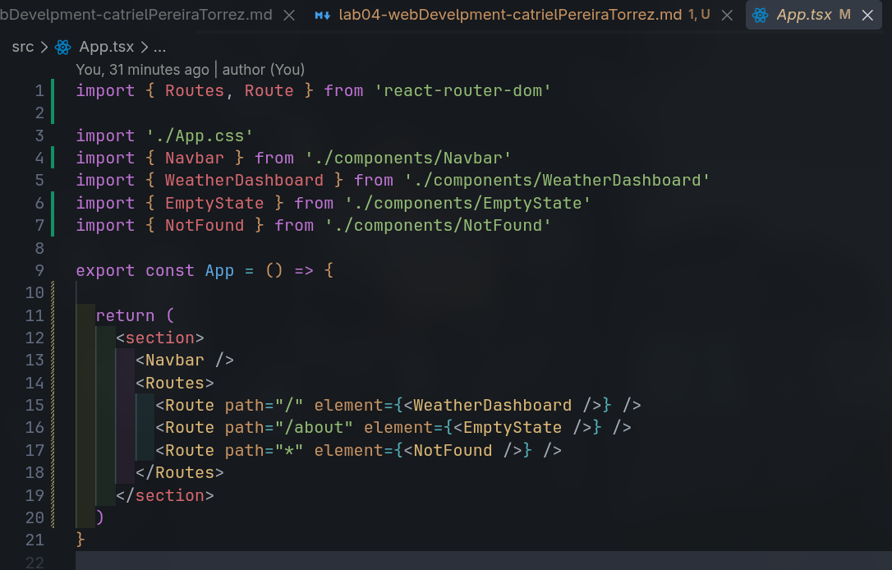
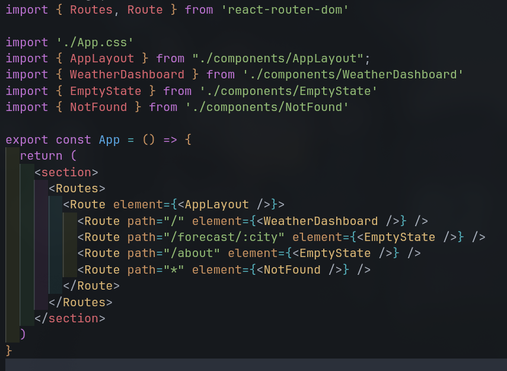
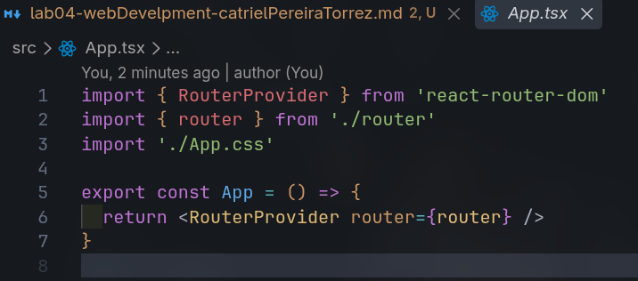

# Web Development — Laboratory 3: Weather Dashboard

**Estudiante:** Catriel Pereira Torrez
**Institución:** Jala University
**Materia:** Web Development
**Documento:** Laboratorio Semana 3
**Fecha:** 20 de septiembre, 2026

## 1. Enrutamiento (React Router)

Para poder realizar routeo primero cree un componente nuevo llamado Navbar



Que se ve así:



Y en la App.tsx en lugar de solo colocar nuestra pagina padre, colocaré Route, no sin antes wrappear todo `<App />` con la tag `<BrowserRouter />` en `main.tsx`





Ahora las etiquetas `<NavLink />` pueden redirigir a las routes como React esta pensado.

Uso `<NavLink />` y no `<Link />` porque, aparte de ser una etiqueta mas semantica, tiene un valor valor booleano integrado que te dice si estas o no seleccionandola, lo que sirve mucho para darle estilos dinamicos haciendo uso de la concatenacion de strings en las className de las tags.

Para lograr que mi pagina sea dinamica y mantenga el navbar y en un futuro un footer, voy a crear un layout, que será como un marco de página o contenedor para cada página que cambie con las routes.

Para eso voy a crear una estructura anidada de Routes en App, de esta manera:



Y también creé el `AppLayout` que es:


Estoy preveyendo la existencia de Forescast por city, feature que aún no hice.

Por ahora redirige a una mi componente estático `EmptyState`

## Refactorización: Migración a Data Router (`createBrowserRouter`)

Para seguir las mejores prácticas y desacoplar responsabilidades, saqué la configuración de rutas de `App.tsx` a un módulo dedicado en `src/router/index.tsx` usando `createBrowserRouter`.

¿Por qué este cambio?

- **Separación de responsabilidades:** `App.tsx` queda limpio y no se llena de imports de páginas.
- **Escalabilidad:** La navegación se define como un arreglo de objetos centralizado fuera del ciclo de render de React.
- **Data Loaders:** Permite precargar datos de la API en rutas dinámicas como `/forecast/:city`.

En `src/router/index.tsx`:


Con esto, `App.tsx` solo consume el router mediante `<RouterProvider />`:



Algo importante: Al usar `RouterProvider`, se quitó `<BrowserRouter />` de `main.tsx` porque el nuevo router ya gestiona el contexto internamente.

## Forecast page, junto con el dynamic route

Para crear esta sección primero definí en el router una ruta dinámica que recibe el nombre de la ciudad como parámetro:

`/forecast/:city`

### Endpoint y Estructura de la API

Para obtener las predicciones a futuro, consulto el endpoint gratuito de 5 días de OpenWeather pasando las coordenadas:

```bash
curl "https://api.openweathermap.org/data/2.5/forecast?lat=-17.3935&lon=-66.1565&units=metric&appid=$API_KEY"
```

La respuesta nos entrega `cod: "200"`, `cnt: 40`, el objeto `city` y un arreglo `list` con 40 predicciones (una cada 3 horas a lo largo de 5 días). La estructura resumida se ve así:

```json
{
  "cod": "200",
  "message": 0,
  "cnt": 40,
  "list": [
    {
      "dt": 1790618400,
      "main": {
        "temp": 25.27,
        "feels_like": 24.66,
        "temp_min": 25.27,
        "temp_max": 25.27,
        "pressure": 1009,
        "sea_level": 1009,
        "grnd_level": 698,
        "humidity": 31,
        "temp_kf": 0,
        "dew_point": 3.41
      },
      "weather": [
        {
          "id": 801,
          "main": "Clouds",
          "description": "few clouds",
          "icon": "02d"
        }
      ],
      "clouds": { "all": 15 },
      "wind": { "speed": 8.42, "deg": 31, "gust": 8.01 },
      "visibility": 10000,
      "pop": 0,
      "sys": { "pod": "d" },
      "dt_txt": "2026-09-28 18:00:00"
    }
  ],
  "city": {
    "id": 3919968,
    "name": "Cochabamba",
    "coord": { "lat": -17.3935, "lon": -66.1565 },
    "country": "BO",
    "population": 900414,
    "timezone": -14400,
    "sunrise": 1790158404,
    "sunset": 1790202039
  }
}
```

De cada ítem nos interesa:

- `dt_txt`: Fecha y hora de la medición (ej. `2026-09-28 18:00:00`).
- `main.temp` y `feels_like`: Temperatura real y sensación térmica.
- `weather`: Condición (`main`) y el código del icono oficial (`icon: "02d"`).
- `pop`: Probabilidad de precipitación (`0` a `1`).
- `wind.speed`: Velocidad del viento.

### 1. Tipado y Servicio

Antes de consumir la API, tipé en `src/types/weather.ts` la respuesta del endpoint con `ForecastItem` y `ForecastResponse`.

En `src/services/weatherService.ts` creé la función `getForecast(lat, lon)` que consulta el endpoint gratuito de OpenWeather (`/data/2.5/forecast`). Como este endpoint devuelve 40 mediciones (cada 3 horas), filtré la lista quedándome únicamente con los reportes de las `18:00:00`, obteniendo exactamente 1 predicción por día para los próximos 5 días.

### 2. Helper de fecha y Card Component

Para mostrar los días de forma amigable ("Tomorrow", "Fri", "Sat", etc.) en lugar de fechas en números, creé un helper en `src/utils/date.ts`:

- Uso `.replace(' ', 'T')` para convertir la fecha a formato ISO estándar compatible con todos los navegadores.
- Uso `toLocaleDateString('en-US', { weekday: 'short' })` para obtener las 3 letras del día. Si es el primer elemento, muestro `"Tomorrow"`.

Luego creé `ForecastCard` como componente vertical para cada día, mostrando el nombre del día, la condición, el icono oficial de OpenWeather (`@2x.png`), temperatura y métricas de viento y probabilidad de lluvia.

### 3. Navegación programática con coordenadas

En `LocationCard` añadí un botón para navegar hacia el pronóstico. Como ya teníamos las coordenadas (`lat` y `lon`) de la ciudad buscada en el dashboard, usé el hook `useNavigate` para viajar hacia la ruta pasando las coordenadas:

- En la URL mediante query params: `?lat=${lat}&lon=${lon}`
- En memoria mediante `state: { lat, lon, name, country }`

### 4. Componente `ForecastDetails`

En la página de destino combino varios hooks:

- `useParams<{ city: string }>()`: para leer el nombre de la ciudad de la URL.
- `useLocation()`: para leer las coordenadas desde el `state` en memoria.
- `useSearchParams()`: como respaldo por si el usuario recarga la página (F5) y el `state` se pierde, recuperando las coordenadas directamente de la URL.
- `useEffect()`: para disparar la petición a `getForecast(lat, lon)` y guardar los datos en un estado `forecastList`.

Finalmente, recorro los reportes con un `.map()` dentro de una cuadrícula de 5 columnas renderizando las tarjetas `ForecastCard`.

## 2. Gestión de Estado (`useContext`)

## 3. Hook Personalizado (`useFetch`)

## 4. Rendimiento (`lazy loading`)
